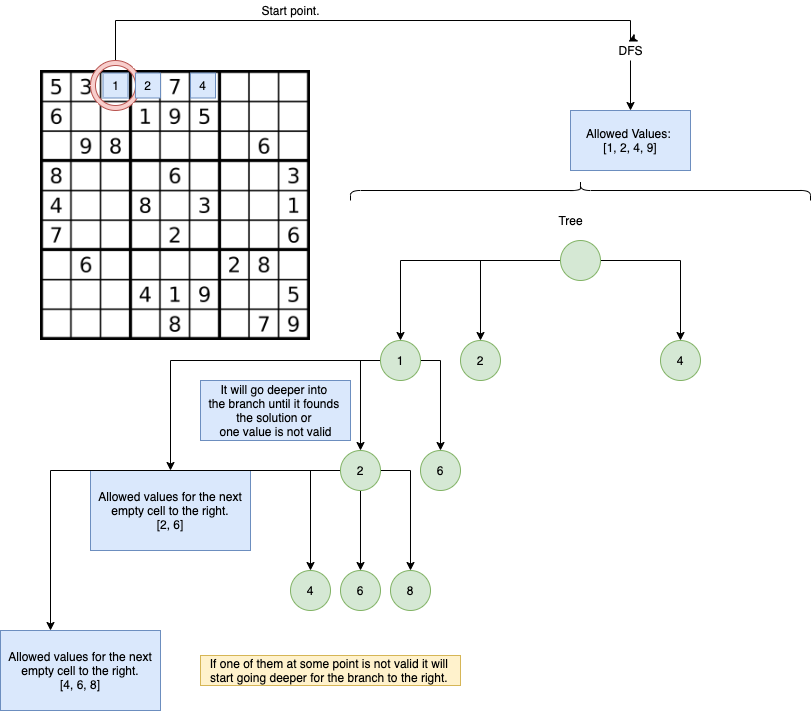

# Sudoku 

## Solving Sudoku: 
To solve the Sudoku it uses a DFS Search Algorithm (Depth First Search). 
It does not matter the number of cells that are filled on the initial state. 
 

File: app/create_sudoku.py

## Sudoku Creator:

To create a Sudoku, the it creates a 9x9 grid with the 3x3 sub matrix on the diagonal filled. 
The rules of the game does not depend of the values of the diagonal, just that the values on the 3x3 matrix are unique and from 1 - 9.

Then it uses the algorithm to solve Sudokus and we remove some elements. 

File: app/create_sudoku.py 

## Extra Notes: 

This is an school project so for the delivery I need to repeat the functions over the code and break the DRY principle. 

 
 